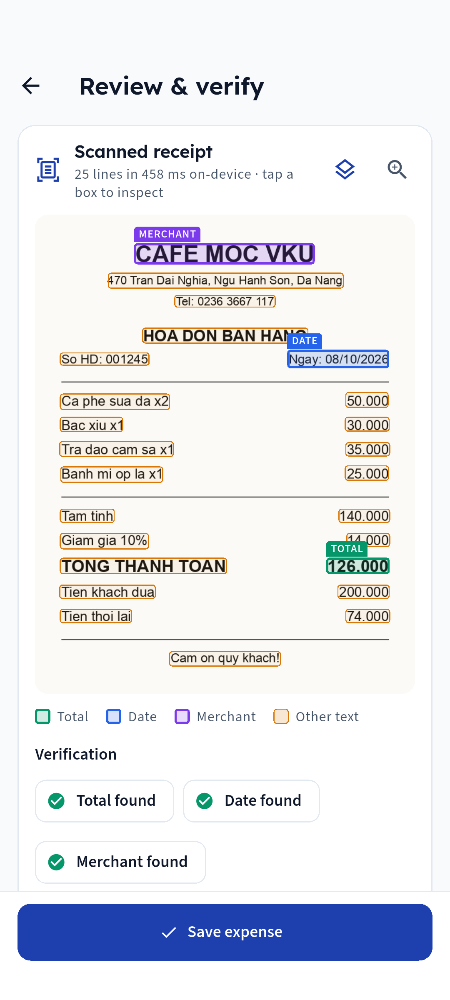
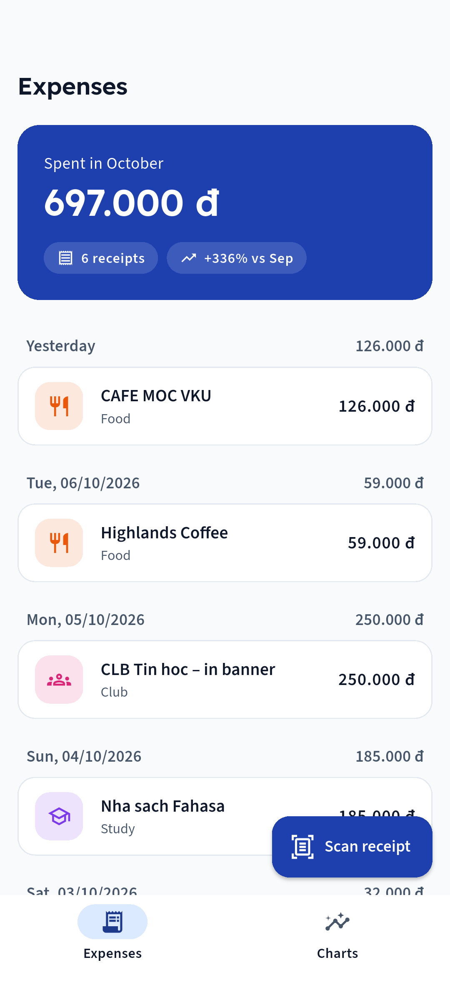
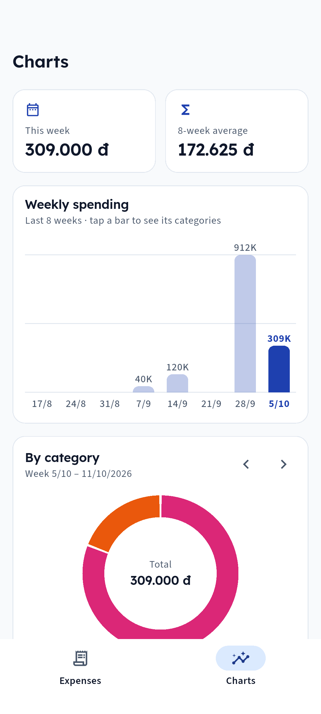
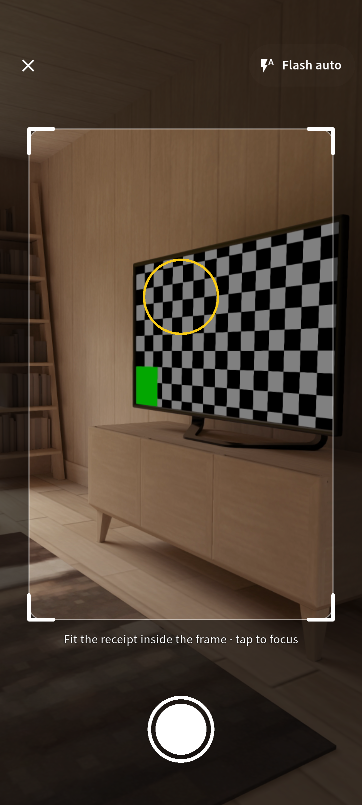
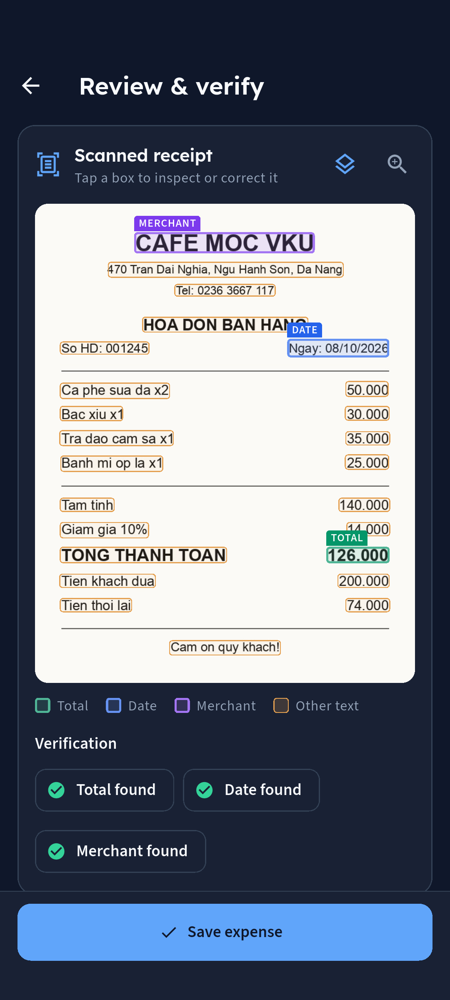
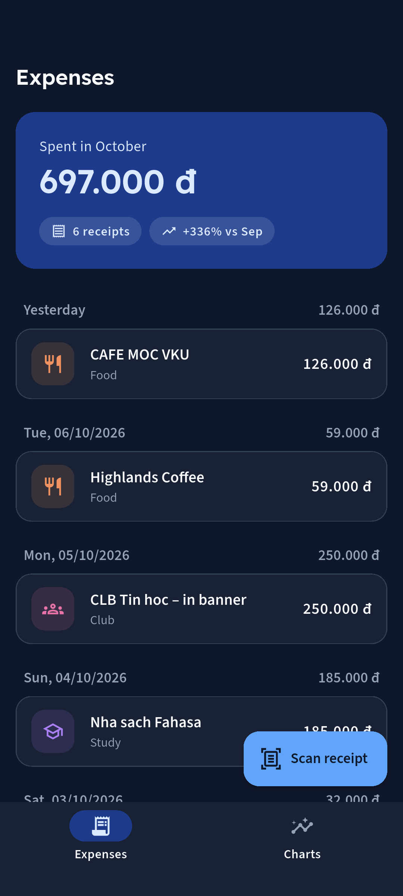
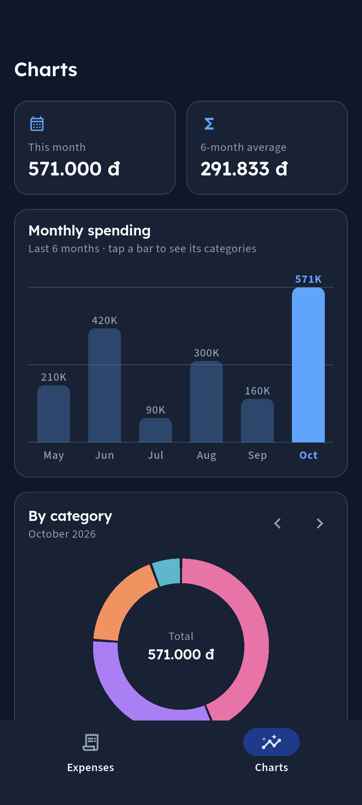

# Receipt OCR & Expense Tracker — Mini-Project 3 (VKU)

Flutter app for VKU students and club managers: photograph a cash receipt, read the **total, date and merchant on-device** with ML Kit, **verify and correct** the values on a review screen, and keep the history in **SQLite** with **animated charts**.

| | Link |
|---|---|
| 🌐 **Live web demo** (open on a phone → *Add to Home screen / Install app*) | https://sunsanti.github.io/receipt-ocr-expense-tracker/ |
| 📱 **Android app** with on-device OCR (APK) | [receipt-tracker.apk](https://github.com/sunsanti/receipt-ocr-expense-tracker/releases/latest/download/receipt-tracker.apk) · [all downloads / install steps](https://github.com/sunsanti/receipt-ocr-expense-tracker/releases/latest) |

The web demo has manual entry, SQLite in the browser (WebAssembly) and the charts; **receipt scanning (ML Kit) needs the Android app**.

```
Camera Capture  →  ML Kit OCR       →  ReceiptParser
(image_picker)     TextRecognizer      (Regex Engine)
                                             ↓
Animated Charts ←  Riverpod State   ←  Local SQLite DB
(CustomPainter)    NotifierProvider    (sqflite CRUD)
```

| Camera (frame, focus, flash) | Review & verify (OCR boxes) | Expenses + thumbnails | Weekly charts |
|---|---|---|---|
|  |  |  |  |
|  |  |  |  |

## Features
- **In-app camera** (`camera`): live viewfinder, flash toggle (off / auto / on / torch), tap-to-focus (+ exposure) with a focus ring, and a receipt frame overlay; the photo is **cropped to the frame** before OCR. Gallery import still available.
- **On-device OCR** (`google_mlkit_text_recognition`, Latin script, offline, no cloud cost). The review screen shows how long recognition took; the recognizer is kept alive so only the first scan pays for loading the model. Lines are re-joined into visual rows so "TOTAL" and its price end up together.
- **ReceiptParser** (pure Dart regex): Vietnamese + English keywords, ignores subtotal / cash given / change / phone numbers, `125.000` vs `12,50` separators, several date formats (incl. OCR-split dates like `08/1 0/2026`).
- **Review & Verification screen**: every OCR line is drawn as a tappable box over the photo, tagged *Total / Date / Merchant*; tap a box to see its bounding values (`x, y, w, h`), fix the text and use it for a field; edit the raw text and *Parse again*. Nothing is written to SQLite before **Save**.
- **Riverpod** `AsyncNotifierProvider` over `sqflite` CRUD; list, totals and charts update together; swipe-to-delete with Undo.
- **Categories**: Food, Study, Travel, Gear, Entertainment (DB schema v2 migrates older data: Transport→Travel, Club/Other→Entertainment).
- **Receipt thumbnails** cached in the app documents directory (`thumbs/`, max 480 px); shown in the list and when editing. Unused files are cleaned up at startup (so Undo still works).
- **Animated `CustomPainter` charts** (no chart library): weekly spending bars for the last 8 weeks (tap a bar to pick the week) and a category donut for that week; respects reduced motion.
- Light/dark design system — see `design-system/receipt-tracker/MASTER.md`.

## Run
```bash
cd receipt_tracker
flutter pub get
flutter test                    # parser, OCR rows, box matching, crop mapping, DB migration, charts
flutter run                     # Android/iOS device (OCR needs a real device or Android emulator)
flutter build apk --release
flutter build web --release     # web demo (SQLite via WebAssembly: web/sqlite3.wasm + web/sqflite_sw.js)
```
Screenshot tour (Android emulator, wipes the app's DB). Install the test build with `-g` so the camera permission is pre-granted:
```bash
flutter build apk --debug -t integration_test/screenshots_test.dart --dart-define=PREFIX=light
adb install -r -g build/app/outputs/flutter-apk/app-debug.apk
flutter drive -d emulator-5554 --driver test_driver/integration_test.dart --target integration_test/screenshots_test.dart \
  --dart-define=PREFIX=light --use-application-binary build/app/outputs/flutter-apk/app-debug.apk
```

## Docs
- Progress: `todo.md` · Design system: `design-system/`
- iOS simulator note: ML Kit ships no arm64-simulator slice, so OCR is tested on Android emulator / physical devices.

## Release & deploy
```bash
cd receipt_tracker
flutter build apk --release                        # → GitHub Release asset receipt-tracker.apk
flutter build apk --release --split-per-abi        # → receipt-tracker-arm64-v8a.apk / -armeabi-v7a.apk
flutter build web --release --base-href /receipt-ocr-expense-tracker/
# publish build/web (+ an empty .nojekyll) to the gh-pages branch → GitHub Pages
```
