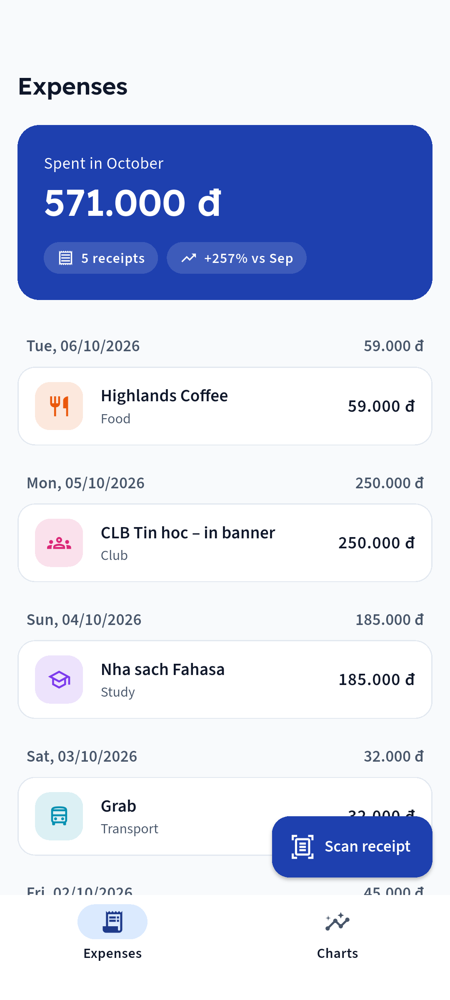
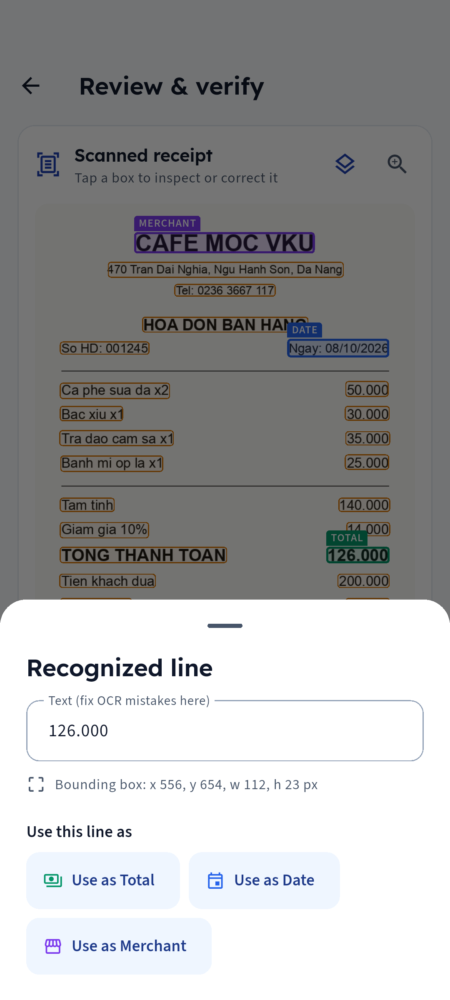
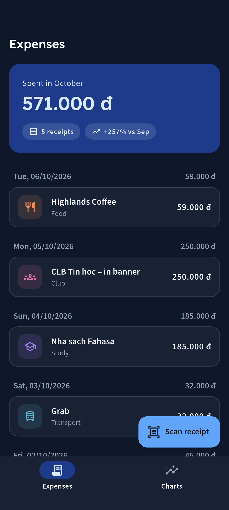
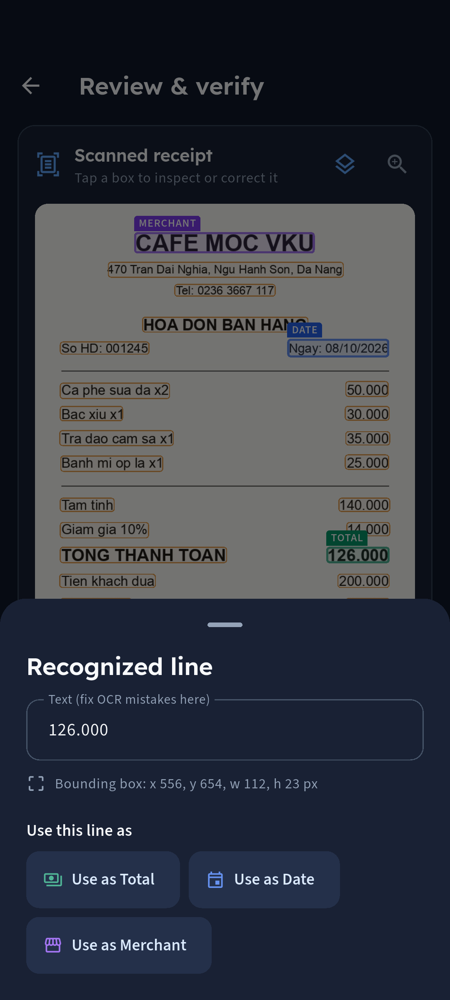

# Receipt OCR & Expense Tracker — Mini-Project 3 (VKU)

Flutter app for VKU students and club managers: photograph a cash receipt, read the **total, date and merchant on-device** with ML Kit, **verify and correct** the values on a review screen, and keep the history in **SQLite** with **animated charts**.

**Web demo:** _(added after deploy)_ — manual entry only; receipt scanning needs the Android/iOS app.

```
Camera Capture  →  ML Kit OCR       →  ReceiptParser
(image_picker)     TextRecognizer      (Regex Engine)
                                             ↓
Animated Charts ←  Riverpod State   ←  Local SQLite DB
(CustomPainter)    NotifierProvider    (sqflite CRUD)
```

| Expenses | Review & verify (OCR boxes) | Box inspector | Charts |
|---|---|---|---|
|  |  |  |  |
|  |  |  |  |

## Features
- **On-device OCR** (`google_mlkit_text_recognition`, Latin script, offline). Lines are re-joined into visual rows so "TOTAL" and its price end up together.
- **ReceiptParser** (pure Dart regex): Vietnamese + English keywords, ignores subtotal / cash given / change / phone numbers, `125.000` vs `12,50` separators, several date formats (incl. OCR-split dates like `08/1 0/2026`).
- **Review & Verification screen**: every OCR line is drawn as a tappable box over the photo, tagged *Total / Date / Merchant*; tap a box to see its bounding values (`x, y, w, h`), fix the text and use it for a field; edit the raw text and *Parse again*. Nothing is written to SQLite before **Save**.
- **Riverpod** `AsyncNotifierProvider` over `sqflite` CRUD; list, totals and charts update together; swipe-to-delete with Undo.
- **Animated `CustomPainter` charts**: 6-month bars (tap to pick a month) and a category donut; respects reduced motion.
- Light/dark design system — see `design-system/receipt-tracker/MASTER.md`.

## Run
```bash
cd receipt_tracker
flutter pub get
flutter test                    # parser, OCR row joining, box matching, charts
flutter run                     # Android/iOS device (OCR needs a real device or Android emulator)
flutter build apk --release
flutter build web --release     # web demo (SQLite via WebAssembly: web/sqlite3.wasm + web/sqflite_sw.js)
```
Screenshot tour (Android emulator, wipes the app's DB):
```bash
flutter drive -d emulator-5554 --driver test_driver/integration_test.dart \
  --target integration_test/screenshots_test.dart --dart-define=PREFIX=shots
```

## Docs
- Specs: `_specs/` · Plans: `_plans/` · Progress: `todo.md` · Design system: `design-system/`
- iOS simulator note: ML Kit ships no arm64-simulator slice, so OCR is tested on Android emulator / physical devices.
